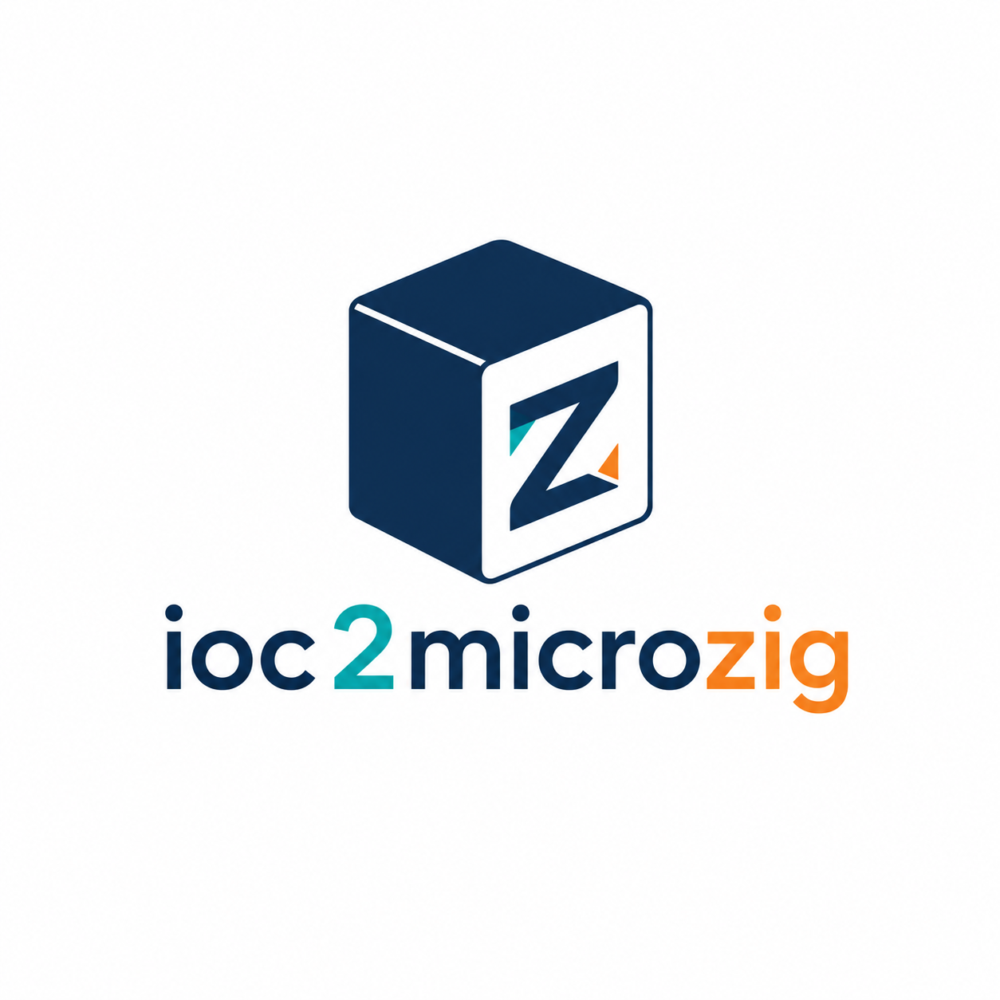

<p align="right">
  <strong>English</strong> | <a href="README.zh-CN.md">简体中文</a>
</p>

<p align="center">
  
</p>

<h1 align="center">ioc2microzig</h1>

<p align="center">
  Generate MicroZig project skeletons and board initialization code from STM32CubeMX <code>.ioc</code> files.
</p>

<p align="center">
  <a href="https://github.com/streetartist/ioc2microzig/actions/workflows/ci.yml"></a>
  
  
  <a href="LICENSE"></a>
</p>

`ioc2microzig` reads the hardware configuration you already maintain in STM32CubeMX and turns it into a MicroZig-oriented Zig firmware project. It preserves CubeMX metadata, creates stable Zig aliases, generates board initialization where the target family is supported, and leaves regeneration-safe `USER CODE` regions for the parts you still want to own by hand.

It is not a CubeMX C-to-Zig transpiler. It works from the `.ioc` source of truth.

## Contents

- [Why](#why)
- [Features](#features)
- [Status](#status)
- [Install](#install)
- [Quick Start](#quick-start)
- [CLI](#cli)
- [Generated Project](#generated-project)
- [Blink Example](#blink-example)
- [Regeneration Workflow](#regeneration-workflow)
- [Validation](#validation)
- [Roadmap](#roadmap)
- [Contributing](#contributing)
- [License](#license)

## Why

STM32CubeMX is still one of the fastest ways to describe pins, clocks, and peripherals for STM32 boards. MicroZig is a strong Zig firmware foundation, but hand-porting CubeMX configuration into Zig is repetitive and easy to get wrong.

`ioc2microzig` bridges that gap:

- keep `.ioc` as a reviewable hardware configuration file;
- generate a MicroZig project with `build.zig` and `build.zig.zon`;
- convert supported STM32 initialization into Zig;
- preserve unsupported details as structured data instead of dropping them;
- regenerate safely while keeping user-owned firmware and build customization code.

## Features

- Parses STM32CubeMX `.ioc` files into typed Python models.
- Generates MicroZig project files, source layout, and local MicroZig dependency metadata.
- Emits stable aliases in `board.zig` for pins and peripherals.
- Preserves raw CubeMX data in `cubemx.zig` and `cubemx.ioc.json`.
- Generates family-specific `board_init.zig` through pluggable backends.
- Preserves user code across regeneration with CubeMX-style `USER CODE BEGIN/END` markers.
- Provides backend modes for HAL-level, register-level, `hal.pins`, and metadata-only output.

## Status

`ioc2microzig` is alpha software. The STM32F103C8 / Blue Pill `PC13` blink path has been tested on hardware, but generated initialization should still be reviewed before flashing real devices.

| MCU family | Default backend | Current coverage |
| --- | --- | --- |
| STM32F1 | `hal` | RCC, GPIO, PWR/SWJ remap, TIM counter/PWM, USART/UART, I2C, SPI, ADC aliases and analog GPIO setup. |
| STM32F4/F40x/F41x/F42x/F43x | `registers` | GPIO clocks, MODER, and AFR register writes. RCC/TIM/UART details are preserved as TODOs and CubeMX summaries. |
| Other STM32 families | `pins` | Attempts `hal.pins.GlobalConfiguration` and basic UART v3 setup. Unsupported details are preserved as TODOs. |

The generator intentionally keeps uncertain or unsupported configuration visible in generated comments, `cubemx.zig`, and `cubemx.ioc.json`.

## Install

Requirements:

- Python 3.10 or newer;
- a local MicroZig checkout for generated projects;
- the Zig version expected by that MicroZig checkout;
- STM32CubeMX only if you want to edit the source `.ioc` file.

Install from this repository:

```sh
python -m pip install -e .
```

For source-only usage:

```sh
python -m pip install -r requirements.txt
python ioc2microzig.py --help
```

## Quick Start

Generate a project from an `.ioc` file:

```sh
ioc2microzig path/to/Board.ioc -o board-microzig --force --copy-ioc
cd board-microzig
zig build
```

Or run without installing the console entry point:

```sh
python ioc2microzig.py path/to/Board.ioc -o board-microzig --force --copy-ioc
```

By default, the output directory is derived from the CubeMX project name. For example, `MotorTest.ioc` generates `motor-test-microzig`.

## CLI

```text
usage: ioc2microzig [-h] [-o OUT] [--include INCLUDE] [--target TARGET]
                    [--microzig-path MICROZIG_PATH]
                    [--gpio-api {auto,data,hal,registers,pins,...}]
                    [--force] [--summary-only] [--copy-ioc]
                    ioc
```

| Option | Description |
| --- | --- |
| `ioc` | Path to the STM32CubeMX `.ioc` file. |
| `-o, --out` | Output project directory. Defaults to `<project-name>-microzig`. |
| `--include` | Comma-separated selection such as `all`, `gpio,uart,tim`, or `USART1`. |
| `--target` | Override the MicroZig target expression, for example `stm32.chips.STM32F103C8`. |
| `--microzig-path` | Path written into `build.zig.zon` for the local MicroZig dependency. |
| `--gpio-api` | Initialization backend. Defaults to `auto`. |
| `--force` | Overwrite generated files in an existing output directory. |
| `--summary-only` | Parse and print a summary without writing files. |
| `--copy-ioc` | Copy the source `.ioc` into the generated project. |

Backend names:

| Backend | Purpose |
| --- | --- |
| `auto` | Selects the best backend for the detected MCU family. |
| `data` | Metadata-only output with aliases and stubs; no hardware initialization. |
| `hal` | Uses MicroZig HAL APIs such as `rcc.apply()`, `gpio.Pin`, and `GPTimer`. |
| `registers` | Writes `microzig.chip.peripherals` registers directly. |
| `pins` | Uses `hal.pins.GlobalConfiguration` when the target exposes it. |

Legacy aliases are still accepted: `manifest/comments -> data`, `f1-runtime -> hal`, `f4-basic -> registers`, `pins-v2 -> pins`.

## Generated Project

```text
board-microzig/
  build.zig
  build.zig.zon
  cubemx.ioc.json
  src/
    main.zig
    app.zig
    board.zig
    board_init.zig
    cubemx.zig
    peripherals.zig
    pin_manifest.zig
```

Important files:

| File | Role |
| --- | --- |
| `src/main.zig` | Calls `board_init.init()` and then `app.run()`. |
| `src/app.zig` | Application entry point. This is where most firmware logic starts. |
| `src/board_init.zig` | Generated board-level initialization for the selected backend. |
| `src/board.zig` | Stable aliases for pins, peripherals, RCC, DMA, and NVIC metadata. |
| `src/cubemx.zig` | Typed tables generated from the selected `.ioc` content. |
| `src/peripherals.zig` | One extension stub per discovered CubeMX component/peripheral. |
| `cubemx.ioc.json` | JSON snapshot of parsed CubeMX configuration. |

The generated `main.zig` is intentionally small:

```zig
try board_init.init();
try app.run();
```

## Blink Example

For a common STM32F103C8 / Blue Pill board, configure `PC13` as `GPIO_Output` in STM32CubeMX and regenerate the project. The STM32F1 backend initializes the GPIO from `.ioc`, so the application only needs a time source and a loop:

```zig
const board = @import("board.zig");
const board_init = @import("board_init.zig");
// USER CODE BEGIN app.imports
const microzig = @import("microzig");
// USER CODE END app.imports

// USER CODE BEGIN app.decls
const time = microzig.hal.time;
const led = board_init.pins.pc13_gpio_output;
// USER CODE END app.decls

pub fn run() !void {
    _ = board.pins;
    _ = board_init.pins;
    _ = board_init.pwm;
    // USER CODE BEGIN app.run.setup
    time.init_timer(.TIM3);
    // USER CODE END app.run.setup

    while (true) {
        // USER CODE BEGIN app.run.loop
        led.toggle();
        time.sleep_ms(500);
        // USER CODE END app.run.loop
    }
}
```

If you give the pin a CubeMX User Label, use the generated alias from `src/board_init.zig`. Many Blue Pill boards wire the `PC13` LED as active-low, so the visible on/off state may be inverted.

Build and flash:

```sh
zig build
zig objcopy -O binary zig-out/firmware/<name>.elf zig-out/firmware/<name>.bin
st-flash write zig-out/firmware/<name>.bin 0x08000000
```

You can also flash ELF/BIN artifacts with STM32CubeProgrammer, OpenOCD, or probe-rs.

## Regeneration Workflow

Generated files use CubeMX-style user regions:

```zig
// USER CODE BEGIN app.run.loop
// USER CODE END app.run.loop
```

When you regenerate with `--force`, code inside matching regions is preserved in:

- `build.zig`;
- `src/app.zig`;
- `src/board_init.zig`;
- `src/peripherals.zig`.

Common application regions include `app.imports`, `app.decls`, `app.run.setup`, `app.run.loop`, `app.helpers`, and `app.callbacks`. `build.zig` also has `build.imports`, `build.options`, `build.firmware`, and `build.decls` for build-system additions such as C sources, include paths, or custom build steps.

Code outside those regions belongs to the generator and may be replaced. Do not rename the `USER CODE BEGIN/END` markers unless you also update the generator.

## Validation

Run repository checks:

```sh
python -m unittest discover -s tests
python -m compileall ioc2microzig
```

Generate the STM32F1 fixture:

```sh
python ioc2microzig.py tests/fixtures/stm32f1_complex.ioc -o stm32f1-complex-microzig --force --copy-ioc
zig build --build-file stm32f1-complex-microzig/build.zig
```

MicroZig builds may print `run exe regz (chips) stderr` while generating register data. That line is a build step label, not an error by itself. Treat the build as failed only when Zig exits non-zero or reports a terminating `error:`.

## Roadmap

- Broaden STM32F1 peripheral coverage where MicroZig HAL support is available.
- Add more register-level backends for STM32 families without complete HAL APIs.
- Improve DMA/NVIC generation beyond metadata preservation.
- Add generated debug configuration templates for common ST-Link/OpenOCD/probe-rs workflows.
- Grow fixture coverage with real `.ioc` files from more boards and MCU families.

## Contributing

Contributions are welcome, especially:

- new `.ioc` fixtures for real boards;
- backend fixes for specific STM32 families;
- MicroZig API compatibility updates;
- tests that lock down generated Zig output.

Before opening a pull request, run:

```sh
python -m unittest discover -s tests
python -m compileall ioc2microzig
```

For new chip support, prefer adding a family context builder under `ioc2microzig/backends/families/` plus a Jinja2 template under `ioc2microzig/backends/templates/`. Keep Python responsible for structured data and templates responsible for Zig output.

## License

MIT. See [LICENSE](LICENSE).
